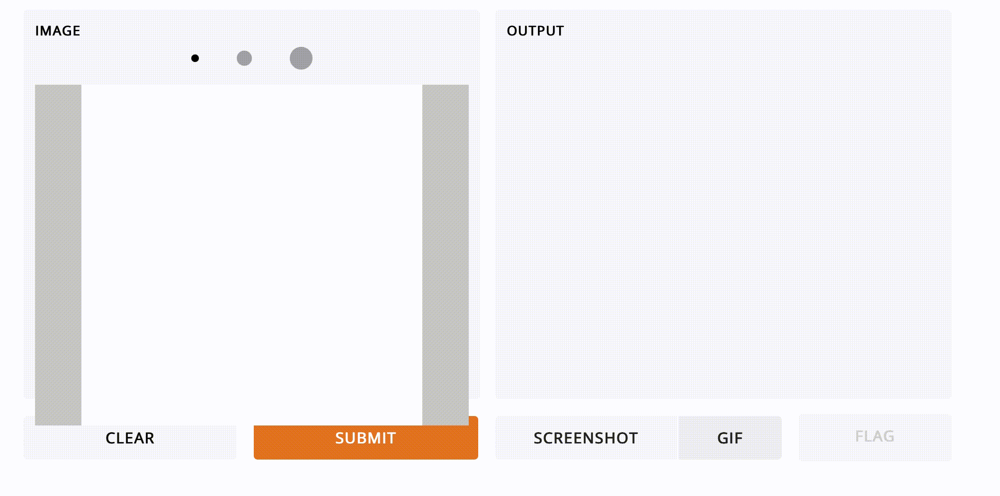
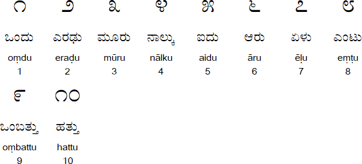

## Kannada Handwritten Digit Recognizer

This project is similar to the MNIST image classification project but with handwritten Kannada numerals, provided by [Vinay Prabhu](https://www.kaggle.com/c/Kannada-MNIST). The dataset consists of around 70,000 images for the training set and 5000 images for the test. The model chosen for this multiclass classification is CNN (convolutional neural networks) and the goal is to accurately classify the images into one of ten labels. 

[Image Credit](https://omniglot.com/writing/kannada.htm)

### Project Description : Modules used, Data Preprocessing, Data generator, Model definition, model training 

### Model Performance 

### GUI : Gradio 
